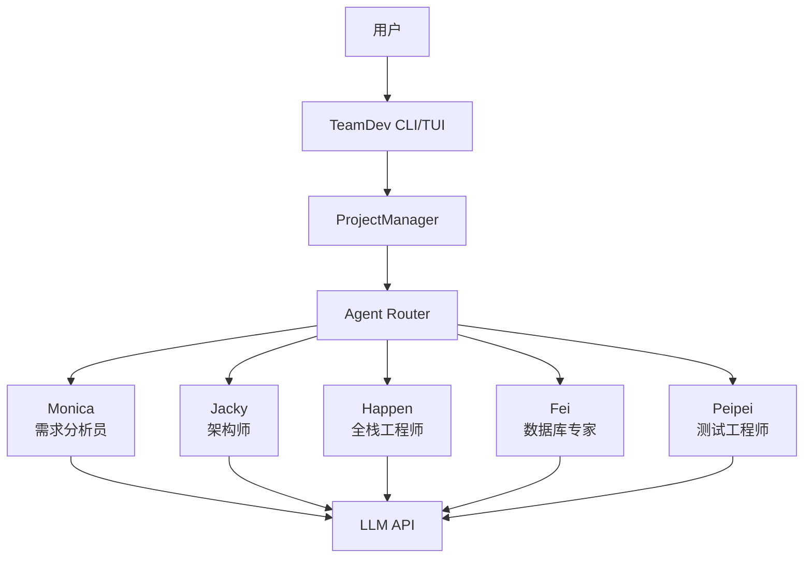

# TeamDev - AI团队协作开发平台

TeamDev是一个基于多Agent协作的软件开发平台，旨在通过AI团队的协同工作来自动化软件开发流程。

## 项目架构



## 角色系统

TeamDev包含以下AI角色：

- **Monica (需求分析员/产品经理)** - 负责与用户交互，收集需求，进行需求分析，并将任务分配给其他角色
- **Jacky (架构师)** - 负责系统架构设计和技术选型
- **Happen (全栈工程师)** - 负责前后端代码实现
- **Fei (数据库专家)** - 负责数据库设计和优化
- **Peipei (测试工程师)** - 负责测试用例设计和质量保证

## 项目结构

```
TeamDev/
├── core/                    # 核心模块
│   ├── __init__.py
│   ├── roles/               # Agent角色实现
│   │   ├── __init__.py
│   │   ├── base_role.py     # 基础角色类
│   │   ├── monica.py        # 需求分析员角色
│   │   ├── jacky.py         # 架构师角色
│   │   ├── happen.py        # 全栈工程师角色
│   │   ├── fei.py           # 数据库专家角色
│   │   └── peipei.py        # 测试工程师角色
│   └── project_manager/     # 项目管理器
│       ├── __init__.py
│       ├── manager.py       # 项目管理核心逻辑
│       └── api.py           # 项目管理API接口
├── tui_form/                # TUI界面配置
│   ├── mainform.json        # 主界面配置
│   └── gui_dev_guide.md     # GUI开发指南
├── agents-config.md         # Agent配置文件
├── requirements.txt         # 项目依赖
└── README.md
```

## 安装和使用

### 环境要求

- Python 3.8+
- pip包管理器

### 安装步骤

1. 克隆项目仓库：
   ```bash
   git clone <repository-url>
   cd TeamDev
   ```

2. 安装依赖：
   ```bash
   pip install -r requirements.txt
   ```

3. 配置Agent（可选）：
   编辑 `agents-config.md` 文件来调整Agent的行为和配置

4. 运行项目：
   ```bash
   python main.py
   ```

## 开发指南

### 添加新角色

1. 在 `core/roles/` 目录下创建新的角色文件
2. 继承 `BaseRole` 类并实现必要的方法
3. 在 `core/roles/__init__.py` 中导出新角色
4. 在 `core/__init__.py` 的 `__all__` 列表中添加新角色
5. 更新 `agents-config.md` 添加新角色的配置

### 项目管理

项目管理功能由 `ProjectManager` 类提供，支持：
- 项目创建和初始化
- 项目信息管理
- 文件保存和备份
- 项目切换

### 界面开发

TUI界面配置存储在 `tui_form/` 目录中：
- `mainform.json` 定义主界面布局
- `gui_dev_guide.md` 提供界面开发指南

## 配置说明

Agent的配置信息存储在 `agents-config.md` 文件中，包含：
- 每个Agent的角色定义和能力描述
- 使用的LLM模型配置
- Agent间协作流程图

## 许可证

本项目采用MIT许可证，详情请见 [LICENSE](LICENSE) 文件。