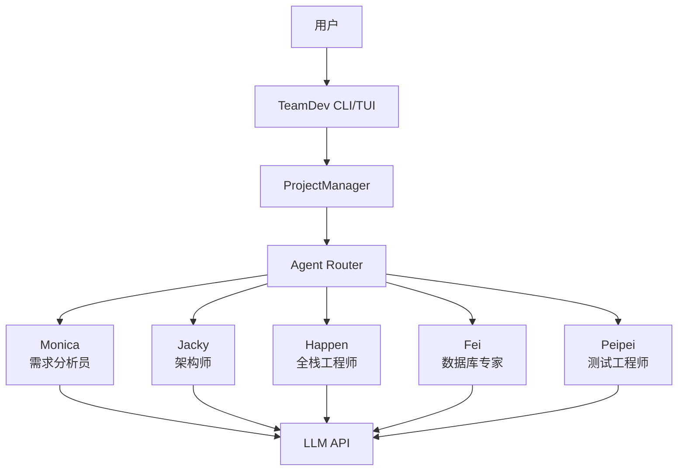

# TeamDev - AI团队协作开发平台

TeamDev是一个基于多Agent协作的软件开发平台，旨在通过AI团队的协同工作来自动化软件开发流程。

## 项目架构



## 角色系统

TeamDev包含以下AI角色：

- **Monica (需求分析员/产品经理)** - 负责与用户交互，收集需求，进行需求分析，并将任务分配给其他角色
- **Jacky (架构师)** - 负责系统架构设计和技术选型
- **Happen (全栈工程师)** - 负责前后端代码实现
- **Fei (数据库专家)** - 负责数据库设计和优化
- **Peipei (测试工程师)** - 负责测试用例设计和质量保证

## 项目结构

```
TeamDev/
├── core/                    # 核心模块
│   ├── __init__.py
│   ├── llm_provider/        # LLM服务提供商集成
│   │   ├── __init__.py
│   │   ├── base.py          # 抽象基类和数据结构
│   │   ├── factory.py       # 工厂模式实现
│   │   ├── openai_provider.py    # OpenAI API集成
│   │   ├── ollama_provider.py    # Ollama本地模型集成
│   │   ├── lmstudio_provider.py  # LMStudio本地模型集成
│   │   └── mock_provider.py      # 测试模拟实现
│   ├── roles/               # Agent角色实现
│   │   ├── __init__.py
│   │   ├── base_role.py     # 基础角色类
│   │   ├── monica.py        # 需求分析员角色
│   │   ├── jacky.py         # 架构师角色
│   │   ├── happen.py        # 全栈工程师角色
│   │   ├── fei.py           # 数据库专家角色
│   │   └── peipei.py        # 测试工程师角色
│   └── project_manager/     # 项目管理器
│       ├── __init__.py
│       ├── manager.py       # 项目管理核心逻辑
│       └── api.py           # 项目管理API接口
├── tui_components/          # TUI界面组件
│   ├── components/          # 各种UI组件实现
│   ├── core/               # TUI核心模块
│   └── examples/           # 组件使用示例
├── tui_form/                # TUI界面配置
│   ├── mainform.json        # 主界面配置
│   └── gui_dev_guide.md     # GUI开发指南
├── ai_settings.json         # AI模型配置文件
├── agents-config.md         # Agent配置文件
├── requirements.txt         # 项目依赖
└── README.md
```

## LLM 服务支持

TeamDev 支持多种 LLM 服务提供商，通过统一的抽象接口实现无缝切换：

### 支持的服务商

1. **OpenAI API** - 支持 GPT-4、GPT-3.5 等模型
2. **Ollama** - 本地部署的开源模型 (Llama、Mistral 等)
3. **LMStudio** - 本地图形化模型管理和部署
4. **Mock Provider** - 测试和开发用模拟实现

### LMStudio 集成

LMStudio 是一个本地化的 AI 模型管理平台，TeamDev 现已完全支持：

**特点：**
- 🔒 **完全本地化** - 数据不出本地环境，保障隐私安全
- 🎯 **图形界面** - 通过友好的界面管理模型下载和运行
- ⚡ **即插即用** - 兼容 OpenAI API 格式，无需额外配置
- 🚀 **高性能** - 原生优化，支持 GPU 加速

**配置示例：**
```json
{
  "name": "lmstudio-local",
  "type": "lmstudio",
  "base_url": "http://127.0.0.1:1234",
  "model_name": "your-model-name",
  "temperature": 0.7
}
```

## 安装和使用

### 环境要求

- Python 3.9+
- pip包管理器
- LMStudio (推荐) 或其他支持的 LLM 服务

### 安装步骤

1. 克隆项目仓库：
   ```bash
   git clone <repository-url>
   cd TeamDev
   ```

2. 安装依赖：
   ```bash
   pip install -r requirements.txt
   ```

3. 配置 LLM 服务：
   - **使用 LMStudio (推荐)**：
     1. 下载并安装 LMStudio
     2. 启动 LMStudio 并加载模型
     3. 确保服务运行在 http://127.0.0.1:1234
   
   - **其他服务**：
     编辑 `ai_settings.json` 配置您的 API 密钥和服务地址

4. 运行项目：
   ```bash
   python main.py
   ```

## 开发指南

### 添加新角色

1. 在 `core/roles/` 目录下创建新的角色文件
2. 继承 `BaseRole` 类并实现必要的方法
3. 在 `core/roles/__init__.py` 中导出新角色
4. 在 `core/__init__.py` 的 `__all__` 列表中添加新角色
5. 更新 `agents-config.md` 添加新角色的配置

### 项目管理

项目管理功能由 `ProjectManager` 类提供，支持：
- 项目创建和初始化
- 项目信息管理
- 文件保存和备份
- 项目切换

### 界面开发

TUI界面配置存储在 `tui_form/` 目录中：
- `mainform.json` 定义主界面布局
- `gui_dev_guide.md` 提供界面开发指南

## 配置说明

Agent的配置信息存储在 `agents-config.md` 文件中，包含：
- 每个Agent的角色定义和能力描述
- 使用的LLM模型配置
- Agent间协作流程图

## 许可证

本项目采用MIT许可证，详情请见 [LICENSE](LICENSE) 文件。