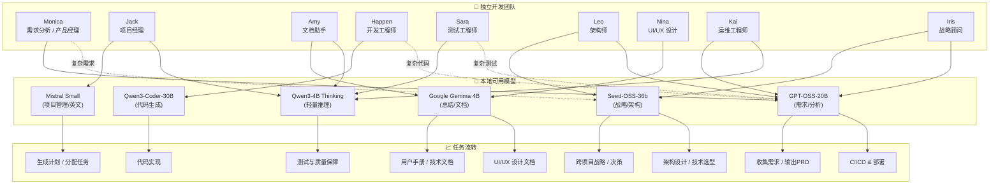

# Agents 配置清单

本文件定义了 TeamDev 中各个 Agent 的角色、任务特点、默认模型，以及备用模型切换规则。

---

## 📌 monica (需求分析员 / 产品经理)
- **身份**: 软件系统顾问、需求分析员  
- **任务**: 收集用户需求、输出 PRD、确认功能优先级  
- **主模型**: `local,openai/gpt-oss-20b`  
- **备用模型**: `bytedance/seed-oss-36b`（复杂场景/战略规划）  
- **轻量任务**: `qwen/qwen3-4b-thinking`

---

## 📌 jack (项目经理)
- **身份**: 进度和资源调度  
- **任务**: 生成任务列表、追踪进度、分配角色  
- **主模型**: `mistralai/devstral-small-2507`  
- **备用模型**: `qwen/qwen3-4b-thinking`（中文环境）  

---

## 📌 amy (文档助手)
- **身份**: 写作与总结助手  
- **任务**: 撰写技术文档、会议纪要、用户手册  
- **主模型**: `google/gemma-3-4b`  
- **备用模型**: `qwen/qwen3-4b-thinking`  

---

## 📌 happen (开发工程师)
- **身份**: 代码生成与实现  
- **任务**: 编写源代码、实现功能、修复 bug  
- **主模型**: `local,qwen/qwen3-coder-30b`  
- **备用模型**: `local,openai/gpt-oss-20b`（架构复杂时）  

---

## 📌 sara (测试工程师 / QA)
- **身份**: 质量保障  
- **任务**: 生成测试计划、单元测试、自动化测试  
- **主模型**: `qwen/qwen3-4b-thinking`（轻量推理足够）  
- **备用模型**: `local,openai/gpt-oss-20b`（复杂测试策略）  

---

## 📌 leo (架构师 / 技术负责人)
- **身份**: 系统架构设计  
- **任务**: 技术选型、架构文档、代码审查  
- **主模型**: `bytedance/seed-oss-36b`（全局推理强）  
- **备用模型**: `local,openai/gpt-oss-20b`  

---

## 📌 nina (UI/UX 设计师)
- **身份**: 界面与体验设计  
- **任务**: 设计规范、交互说明、原型文档  
- **主模型**: `google/gemma-3-4b`  
- **备用模型**: `mistralai/devstral-small-2507`  

---

## 📌 kai (运维 / DevOps 工程师)
- **身份**: 运维与自动化  
- **任务**: 生成 CI/CD pipeline、部署脚本、运维文档  
- **主模型**: `local,openai/gpt-oss-20b`  
- **备用模型**: `qwen/qwen3-4b-thinking`  

---

## 📌 iris (战略/顾问 Agent)
- **身份**: 跨项目顾问、战略层决策  
- **任务**: 长文档撰写、复杂决策、跨 Agent 协调  
- **主模型**: `bytedance/seed-oss-36b`  
- **备用模型**: `local,openai/gpt-oss-20b`

---

## 🔄 模型使用规则
- **小模型优先**: 短对话、轻任务默认走 4B/Small 模型。  
- **大模型切换**: 需求分析、架构、跨项目协调 → 使用 20B / 36B。  
- **专用模型**: 代码相关任务优先使用 `qwen3-coder-30b`。  

---

# 📊 附录：角色分工图

下图展示了 **团队角色 → 模型 → 任务流转** 的整体关系。

    